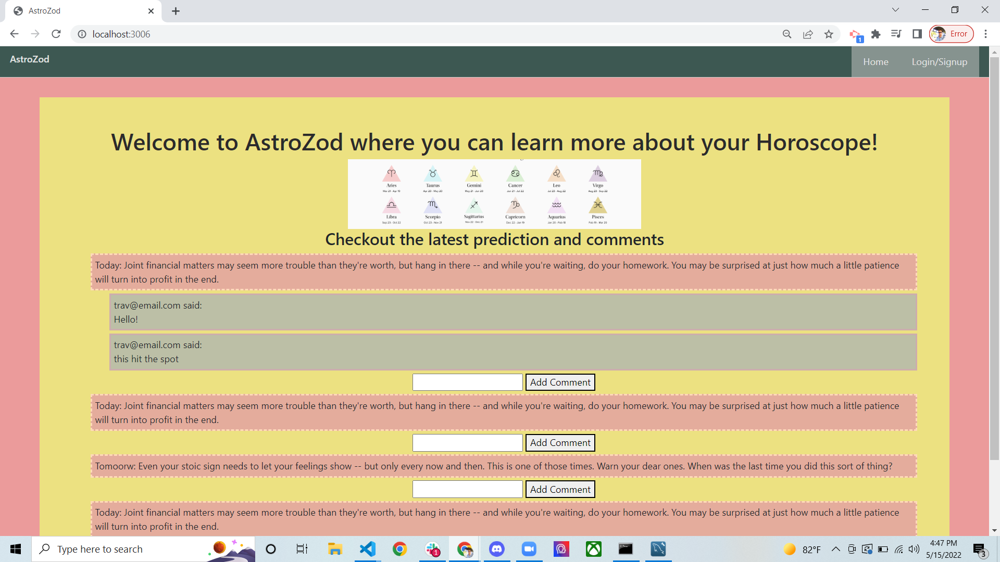
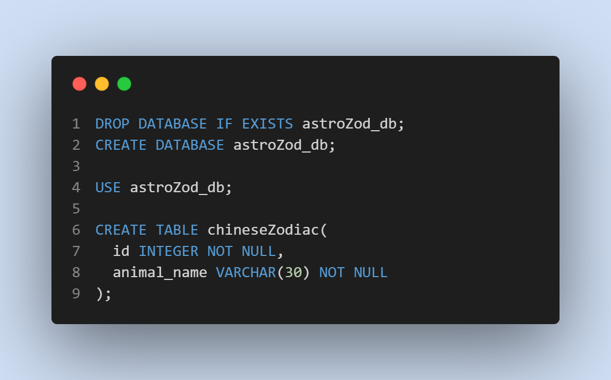

# AstroZod

### Deployed Page
* [Heroku](https://astrozod.herokuapp.com/) 

### Webpage:
*
    

## Description

 * In 2022, the especially younger generations of the world surrounds themselves with different types of Astrology as the basis for finding compatibility for partners, horoscopes to determine fate and in a more classical sense find a chinese zodiac. 
 * This Technology provides all of that by signing up and logging into the page with blog like features that can be used by commenting on different things that are posted. The user can adequately find where he will be in the future. The project was for creating a lens for the future. 
 * Success involved in learning new packages and utilizing API routes for Servers

# Table of contents
1. [Technologies used](#tech-used)
2. [Features](#features)
3. [Screenshots](#screenshots)
4. [Contributors](#contributors)
5. [License](#license)

## Technologies used
* Javascript
* Css
* Handlebars
* MySql
* Sequilize ORM
* Express
* Node
* Horoscope module
* bcrypt package
* Horoscope Package

## Features
* User commenting like a blog to interact with others 
* Login Page/Sign Up with customizable sessions and authentication
* Horoscope/Chinese Zodiac sign look up
* Chinese Animals look up

## Usage
* Downloading necessary packages including: NPM i Horoscope, bcrypt, mysql2 and any others that are not globally installed on your system.
* Screenshots:

## Credits

* Kaylee Jin
* Travis Nichols
* Ryan Chen
* Tianchou Gong

## License
[MIT License](https://choosealicense.com/licenses/mit/)

